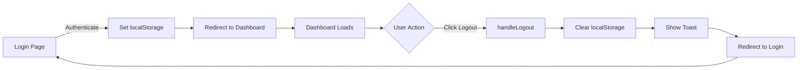

# Builder Logout Feature - Implementation Summary

## ✅ Feature Added

### **Logout Button Location**
- **Position:** Top-right corner of the builder dashboard header
- **Visibility:** Always visible on all dashboard tabs
- **Design:** White outline button with logout icon

### **Logout Functionality**

#### **What Happens When Builder Clicks Logout:**

1. **Clears All Authentication Data:**
   ```typescript
   localStorage.removeItem('builderUserData');
   localStorage.removeItem('currentUser');
   localStorage.removeItem('authToken');
   localStorage.removeItem('builderAuth');
   ```

2. **Shows Success Toast:**
   - Title: "Logged Out"
   - Description: "You have been successfully logged out."

3. **Redirects to Login Page:**
   - After 500ms delay
   - URL: `/auth/login?type=builder&message=logged-out`

### **Code Changes**

#### **1. Added LogOut Icon Import**
```typescript
import { 
  // ... other icons
  LogOut
} from 'lucide-react';
```

#### **2. Added handleLogout Function**
```typescript
const handleLogout = () => {
  console.log('🚪 Builder logout initiated');
  
  // Clear all authentication data
  localStorage.removeItem('builderUserData');
  localStorage.removeItem('currentUser');
  localStorage.removeItem('authToken');
  localStorage.removeItem('builderAuth');
  
  toast({
    title: "Logged Out",
    description: "You have been successfully logged out.",
  });
  
  // Redirect to builder login page
  setTimeout(() => {
    window.location.href = '/auth/login?type=builder&message=logged-out';
  }, 500);
};
```

#### **3. Added Logout Button in Header**
```tsx
<div className="flex-1">
  <div className="flex items-center justify-between">
    <div>
      <h1 className="text-3xl font-bold">{profile.companyName}</h1>
      <p className="text-blue-100 mt-2">
        {profile.description || 'No description available'}
      </p>
    </div>
    <Button 
      onClick={handleLogout}
      variant="outline"
      className="bg-white/10 hover:bg-white/20 text-white border-white/30"
    >
      <LogOut className="h-4 w-4 mr-2" />
      Logout
    </Button>
  </div>
  {/* ... service locations ... */}
</div>
```

## 🎨 UI/UX Details

### **Button Styling:**
- **Background:** Semi-transparent white (white/10)
- **Hover State:** Slightly more opaque (white/20)
- **Border:** White with 30% opacity
- **Text Color:** White
- **Icon:** LogOut icon from lucide-react
- **Position:** Right-aligned in header, next to company name

### **Button States:**

| State | Background | Border | Effect |
|-------|------------|--------|--------|
| Normal | `bg-white/10` | `border-white/30` | Subtle presence |
| Hover | `bg-white/20` | `border-white/50` | Brightens slightly |
| Click | - | - | Shows toast + redirects |

## 🔒 Security Considerations

### **Data Cleared on Logout:**

1. **builderUserData** - Builder profile and session data
2. **currentUser** - Current authenticated user info
3. **authToken** - Authentication token (if any)
4. **builderAuth** - Builder-specific authentication data

### **Redirect Flow:**
```
Dashboard → Logout Click → Clear Storage → Toast Notification → Login Page
```

### **Login Page Parameters:**
- `type=builder` - Ensures builder login form is shown
- `message=logged-out` - Can be used to show "Successfully logged out" message

## 🧪 Testing Checklist

### **Test Scenario 1: Basic Logout**
1. ✅ Log in as a builder
2. ✅ Go to `/builder/dashboard`
3. ✅ Click "Logout" button in top-right
4. ✅ Should see "Logged Out" toast
5. ✅ Should redirect to `/auth/login?type=builder&message=logged-out`
6. ✅ LocalStorage should be cleared

### **Test Scenario 2: Session Persistence**
1. ✅ Log out successfully
2. ✅ Try to access `/builder/dashboard` directly
3. ✅ Should redirect to login (no valid session)

### **Test Scenario 3: Re-login After Logout**
1. ✅ Log out
2. ✅ Log back in with same credentials
3. ✅ Should load dashboard successfully
4. ✅ All data should load normally

### **Verify LocalStorage is Cleared:**
```javascript
// In browser console after logout
console.log(localStorage.getItem('builderUserData')); // Should be null
console.log(localStorage.getItem('currentUser')); // Should be null
console.log(localStorage.getItem('authToken')); // Should be null
console.log(localStorage.getItem('builderAuth')); // Should be null
```

## 📱 Responsive Design

The logout button is responsive:
- **Desktop:** Full button with icon + "Logout" text
- **Mobile:** May need to adjust - consider icon-only on small screens

### **Optional: Mobile Optimization**
```tsx
<Button 
  onClick={handleLogout}
  variant="outline"
  className="bg-white/10 hover:bg-white/20 text-white border-white/30"
>
  <LogOut className="h-4 w-4 md:mr-2" />
  <span className="hidden md:inline">Logout</span>
</Button>
```

## 🔄 Integration with Auth Flow

### **Login → Dashboard → Logout Flow:**



## 🐛 Troubleshooting

### "Logout button not showing"
- Hard refresh (Ctrl+Shift+R)
- Check if `LogOut` icon is imported
- Verify `handleLogout` function exists

### "Logout doesn't redirect"
- Check browser console for errors
- Verify `window.location.href` is working
- Check if there's a redirect blocker

### "Still logged in after logout"
- Clear browser cache manually
- Check for cached service workers
- Verify all localStorage keys are removed

## 🎯 Future Enhancements

### **1. Logout Confirmation Dialog**
```tsx
const [showLogoutDialog, setShowLogoutDialog] = useState(false);

<Dialog open={showLogoutDialog} onOpenChange={setShowLogoutDialog}>
  <DialogContent>
    <DialogTitle>Confirm Logout</DialogTitle>
    <DialogDescription>
      Are you sure you want to log out?
    </DialogDescription>
    <DialogFooter>
      <Button onClick={() => setShowLogoutDialog(false)}>Cancel</Button>
      <Button onClick={handleLogout} variant="destructive">Logout</Button>
    </DialogFooter>
  </DialogContent>
</Dialog>
```

### **2. Session Timeout Warning**
```typescript
// Warn user before auto-logout
useEffect(() => {
  const timeout = setTimeout(() => {
    toast({
      title: "Session Expiring",
      description: "You'll be logged out in 5 minutes due to inactivity.",
    });
  }, 25 * 60 * 1000); // 25 minutes

  return () => clearTimeout(timeout);
}, []);
```

### **3. Remember Me Option**
- Store encrypted credentials (optional)
- Quick re-login after logout

## 📝 Summary

✅ **Logout button added** to builder dashboard header  
✅ **Clears all session data** from localStorage  
✅ **Shows success toast** notification  
✅ **Redirects to login page** with appropriate parameters  
✅ **Secure logout** - removes all authentication tokens  

The builder can now successfully log out from their account! 🎉
