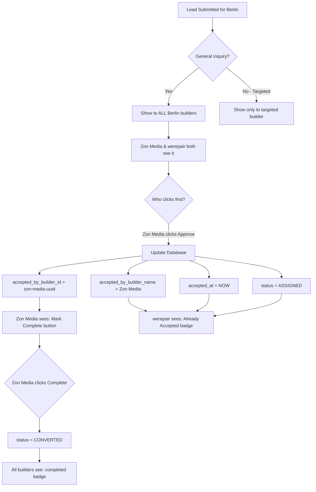

# Lead Acceptance Tracking - Implementation Guide

## 🎯 Problem Solved

**Issue:** When "Zon Media" accepts a general inquiry lead, it still shows with approve/reject buttons on "werepair" dashboard. This allows multiple builders to work on the same lead.

**Solution:** Track which builder accepted each lead and show "Already Accepted" badge to other builders instead of action buttons.

## 📊 Database Changes

### **New Migration: `006_add_accepted_builder_tracking.sql`**

```sql
-- Track which builder accepted a general inquiry lead
ALTER TABLE leads ADD COLUMN IF NOT EXISTS accepted_by_builder_id UUID REFERENCES builder_profiles(id);
ALTER TABLE leads ADD COLUMN IF NOT EXISTS accepted_by_builder_name VARCHAR(255);
ALTER TABLE leads ADD COLUMN IF NOT EXISTS accepted_at TIMESTAMP WITH TIME ZONE;

-- Add index for quick lookups
CREATE INDEX IF NOT EXISTS idx_leads_accepted_by_builder ON leads(accepted_by_builder_id);
```

### **How to Apply Migration:**

1. **Open Supabase Dashboard** → SQL Editor
2. **Copy and paste** the migration SQL above
3. **Click "Run"**
4. ✅ Verify columns are added

**Verify Migration:**
```sql
SELECT 
  column_name, 
  data_type, 
  is_nullable 
FROM information_schema.columns 
WHERE table_name = 'leads' 
  AND column_name IN ('accepted_by_builder_id', 'accepted_by_builder_name', 'accepted_at');
```

Expected result:
```
column_name              | data_type              | is_nullable
-------------------------|------------------------|-------------
accepted_by_builder_id   | uuid                   | YES
accepted_by_builder_name | character varying      | YES
accepted_at              | timestamp with tz      | YES
```

## 🔧 API Changes

### **Updated: `/api/builders/leads/update/route.ts`**

Now when a builder approves a lead, the API:

1. **Updates lead status** to `ASSIGNED`
2. **Records who accepted it:**
   ```typescript
   {
     accepted_by_builder_id: builderId,
     accepted_by_builder_name: "Zon Media",
     accepted_at: "2025-10-27T12:00:00Z"
   }
   ```

**Example API Request:**
```json
PUT /api/builders/leads/update
{
  "leadId": "34300c74-2ff7-4963-9bcb-0b1e6bcd2f18",
  "status": "approved",
  "builderId": "zon-media-uuid"
}
```

**Database Update:**
```sql
UPDATE leads 
SET 
  status = 'ASSIGNED',
  accepted_by_builder_id = 'zon-media-uuid',
  accepted_by_builder_name = 'Zon Media',
  accepted_at = NOW(),
  updated_at = NOW()
WHERE id = '34300c74-2ff7-4963-9bcb-0b1e6bcd2f18';
```

## 💻 Frontend Changes

### **Updated Lead Interface**

Added new fields to track acceptance:
```typescript
interface Lead {
  id: string;
  name: string;
  email: string;
  // ... other fields
  acceptedByBuilderId?: string | null;
  acceptedByBuilderName?: string | null;
  acceptedAt?: string | null;
}
```

### **Updated Lead Transformation**

Now includes accepted_by fields:
```typescript
const transformedLeads = data.data.leads.map((lead: any) => ({
  id: lead.id,
  name: lead.company_name || lead.contact_name,
  // ... other fields
  acceptedByBuilderId: lead.accepted_by_builder_id,
  acceptedByBuilderName: lead.accepted_by_builder_name,
  acceptedAt: lead.accepted_at
}));
```

### **Updated Lead Display Logic**

```typescript
{leads.map((lead) => {
  // Check if this lead was accepted by another builder
  const isAcceptedByOther = lead.acceptedByBuilderId && 
                             lead.acceptedByBuilderId !== currentBuilderId;
  const isAcceptedByMe = lead.acceptedByBuilderId === currentBuilderId;
  
  return (
    // ... lead card JSX
  );
})}
```

## 🎨 UI States

### **State 1: New Lead (Not Accepted by Anyone)**

**For ALL builders serving the location:**
```
┌──────────────────────────────────────────┐
│ shuja ahmad  [pending] [form]            │
│ shuja ahmad                              │
│ rftgyh                                   │
│ 📧 email  📱 phone  💰 $100,000+         │
│                           [✓] [✗]       │ ← Approve/Reject buttons
└──────────────────────────────────────────┘
```

### **State 2: Accepted by "Zon Media"**

**For "Zon Media" (who accepted it):**
```
┌──────────────────────────────────────────┐
│ shuja ahmad  [approved] [form]           │
│ shuja ahmad                              │
│ rftgyh                                   │
│ 📧 email  📱 phone  💰 $100,000+         │
│                    [✓ Mark Complete]    │ ← Complete button
└──────────────────────────────────────────┘
```

**For "werepair" (other builder):**
```
┌──────────────────────────────────────────┐
│ shuja ahmad  [pending] [form]            │
│   [Accepted by Zon Media] ←  Yellow badge│
│ shuja ahmad                              │
│ rftgyh                                   │
│ 📧 email  📱 phone  💰 $100,000+         │
│      ┌──────────────────────────┐       │
│      │  Already Accepted        │       │ ← Yellow info box
│      │  This lead is being      │       │
│      │  handled by Zon Media    │       │
│      └──────────────────────────┘       │
└──────────────────────────────────────────┘
```

### **State 3: Completed**

**For ALL builders:**
```
┌──────────────────────────────────────────┐
│ shuja ahmad  [completed] [form]          │
│   [Accepted by Zon Media]                │
│ shuja ahmad                              │
│ rftgyh                                   │
│ 📧 email  📱 phone  💰 $100,000+         │
│                                          │ ← No buttons
└──────────────────────────────────────────┘
```

## 🔄 Complete Workflow

### **Scenario: General Inquiry Lead for Berlin**



## 🧪 Testing Steps

### **Test 1: First Builder Accepts**

1. **Login as "Zon Media"**
2. Go to `/builder/dashboard` → Leads tab
3. See "shuja ahmad" lead with ✓ and ✗ buttons
4. **Click ✓ (Approve)**
5. ✅ Should show "Mark Complete" button
6. ✅ Check database:
   ```sql
   SELECT 
     company_name,
     status,
     accepted_by_builder_name,
     accepted_at
   FROM leads 
   WHERE company_name = 'shuja ahmad';
   ```
   Expected:
   ```
   company_name | status   | accepted_by_builder_name | accepted_at
   -------------|----------|--------------------------|------------------
   shuja ahmad  | ASSIGNED | Zon Media                | 2025-10-27 12:00
   ```

### **Test 2: Other Builder Sees "Already Accepted"**

1. **Login as "werepair"**
2. Go to `/builder/dashboard` → Leads tab
3. ✅ Should see "shuja ahmad" lead
4. ✅ Should see yellow badge: "Accepted by Zon Media"
5. ✅ Should see yellow box: "Already Accepted - This lead is being handled by Zon Media"
6. ❌ Should NOT see ✓ and ✗ buttons

### **Test 3: Complete the Lead**

1. **Login as "Zon Media"** (the one who accepted it)
2. Go to Leads tab
3. **Click "Mark Complete"**
4. ✅ Lead status changes to "completed"
5. ✅ Database status = CONVERTED
6. **Login as "werepair"**
7. ✅ Lead still visible
8. ✅ Shows "completed" badge
9. ✅ Still shows "Accepted by Zon Media"
10. ❌ No buttons visible

### **Test 4: New Lead - Multiple Builders Can See**

1. **Submit new general inquiry** for Berlin
2. **Login as "Zon Media"**
   - ✅ Should see new lead
   - ✅ Should see ✓ ✗ buttons
3. **Login as "werepair"** (DON'T refresh Zon Media yet)
   - ✅ Should see same lead
   - ✅ Should see ✓ ✗ buttons
4. **werepair clicks ✓ first**
5. **Go back to Zon Media and refresh**
   - ✅ Should now see "Accepted by werepair"
   - ❌ Should NOT see action buttons

## 🔍 Database Queries for Debugging

### **Check Who Accepted a Lead**
```sql
SELECT 
  l.id,
  l.company_name,
  l.status,
  l.accepted_by_builder_name,
  l.accepted_at,
  bp.company_name as builder_name
FROM leads l
LEFT JOIN builder_profiles bp ON bp.id = l.accepted_by_builder_id
WHERE l.company_name = 'shuja ahmad';
```

### **Find All Leads Accepted by a Builder**
```sql
SELECT 
  company_name,
  contact_email,
  city,
  country,
  status,
  accepted_at
FROM leads
WHERE accepted_by_builder_id = (
  SELECT id FROM builder_profiles WHERE company_name = 'Zon Media'
)
ORDER BY accepted_at DESC;
```

### **Find Leads Still Available (Not Accepted)**
```sql
SELECT 
  company_name,
  contact_email,
  city,
  country,
  status,
  is_general_inquiry
FROM leads
WHERE accepted_by_builder_id IS NULL
  AND status = 'NEW'
  AND is_general_inquiry = true
ORDER BY created_at DESC;
```

### **Reset Acceptance (for testing)**
```sql
-- WARNING: Only use in development!
UPDATE leads 
SET 
  accepted_by_builder_id = NULL,
  accepted_by_builder_name = NULL,
  accepted_at = NULL,
  status = 'NEW'
WHERE company_name = 'shuja ahmad';
```

## 🐛 Common Issues & Fixes

### **Issue 1: Buttons still showing after acceptance**
**Symptom:** Other builders still see approve/reject buttons

**Checks:**
1. ✅ Migration run? Check if columns exist
2. ✅ Hard refresh browser (Ctrl+Shift+R)
3. ✅ Check database - is `accepted_by_builder_id` set?

**Fix:**
```sql
-- Verify acceptance was saved
SELECT accepted_by_builder_id, accepted_by_builder_name 
FROM leads 
WHERE id = '{lead-id}';
```

### **Issue 2: Wrong builder name showing**
**Symptom:** Shows "Accepted by null" or wrong name

**Fix:** Check API is fetching builder name:
```typescript
const { data: builderData } = await dbService['client']
  .from('builder_profiles')
  .select('company_name')
  .eq('id', builderId)
  .single();
```

### **Issue 3: "Already Accepted" showing to the builder who accepted**
**Symptom:** Zon Media sees "Already Accepted" on their own lead

**Check:**
```typescript
const isAcceptedByOther = lead.acceptedByBuilderId && 
                          lead.acceptedByBuilderId !== currentBuilderId;
```

Ensure `currentBuilderId` is set correctly in localStorage.

## 📋 Summary

✅ **Database migration** added to track accepted_by fields  
✅ **API updated** to record acceptance when builder approves  
✅ **Frontend shows** different UI based on acceptance status  
✅ **Other builders** see "Already Accepted" badge instead of buttons  
✅ **Lead still visible** to all builders for transparency  
✅ **Only accepting builder** can mark lead as complete  

Now only ONE builder can accept and work on each general inquiry lead! 🎉
