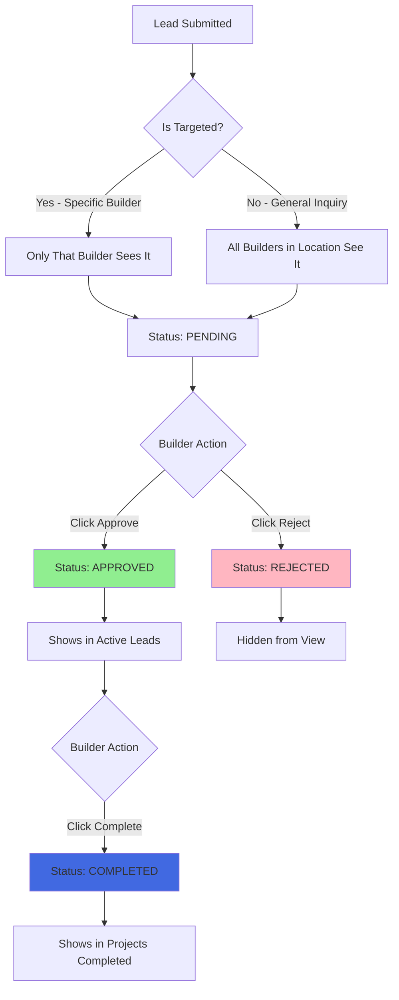

# Builder Lead Workflow - Complete Implementation Guide

## ✅ All Issues Fixed

### 1. **Name Display Fixed**
- **Before:** Showing "Not specified" 
- **After:** Shows company name (e.g., "cvnjv", "szc") first, fallback to contact name

**Code Change:**
```typescript
name: lead.company_name || lead.contact_name || 'Unknown'
```

### 2. **Approve/Reject Buttons Now Working**
- **Created:** `/api/builders/leads/update/route.ts` - New PUT endpoint
- **Updated:** Button handlers to call the API and update database
- **Status Flow:** NEW → ASSIGNED (when approved) → COMPLETED

### 3. **Lead Status Workflow**

#### **Pending Leads** (status: "pending")
- Shows in "Incoming Leads" section
- **Buttons:** ✅ Approve | ❌ Reject
- **Action:** Builder decides whether to accept the lead

#### **Active Leads** (status: "approved") 
- Counter shows in "Active Leads" card
- Shows in leads list with status "approved"
- **Button:** ✅ Complete
- **Action:** Builder marks project as done

#### **Completed Projects** (status: "completed")
- Counter shows in "Projects Completed" card
- Shows in leads list with status "completed"
- **No buttons** - Final state

#### **Rejected Leads** (status: "rejected")
- Hidden from view (filtered out)
- Still in database for admin tracking

### 4. **Location-Based Lead Visibility**

Already implemented in `/api/builders/leads/route.ts`:

**A builder sees a lead if:**

1. **Lead is targeted to them specifically:**
   ```typescript
   if (lead.targeted_builder_id === builderProfile.id) {
     return true; // Only this builder sees it
   }
   ```

2. **Lead is a general inquiry matching their service locations:**
   ```typescript
   if (lead.is_general_inquiry === true) {
     // Check headquarters match
     if (lead.search_location_city === builder.headquarters_city ||
         lead.search_location_country === builder.headquarters_country) {
       return true; // All builders in this location see it
     }
     
     // Check service locations match
     if (builder.service_locations.includes(lead.search_location)) {
       return true; // All builders serving this location see it
     }
   }
   ```

## 📊 Complete Status Flow



## 🗂️ Database Status Mapping

| Frontend Status | Database Status | Visible in Dashboard | Buttons Shown |
|----------------|-----------------|---------------------|---------------|
| `pending` | `NEW` | ✅ Incoming Leads | Approve, Reject |
| `approved` | `ASSIGNED` | ✅ Incoming Leads | Complete |
| `completed` | `COMPLETED` | ✅ Incoming Leads | None |
| `rejected` | `REJECTED` | ❌ Hidden | None |

## 🔄 API Endpoints

### GET `/api/builders/leads?builderId={id}`
**Purpose:** Fetch all relevant leads for a builder

**Returns:**
```json
{
  "success": true,
  "data": {
    "leads": [...],
    "stats": {
      "total": 4,
      "targeted": 2,
      "locationMatched": 2,
      "byStatus": {
        "NEW": 2,
        "ASSIGNED": 1,
        "COMPLETED": 1
      }
    }
  }
}
```

### PUT `/api/builders/leads/update`
**Purpose:** Update lead status (approve, reject, complete)

**Request:**
```json
{
  "leadId": "uuid",
  "status": "approved", // or "rejected", "completed"
  "builderId": "builder-uuid"
}
```

**Response:**
```json
{
  "success": true,
  "data": {
    "id": "uuid",
    "status": "ASSIGNED",
    ...
  }
}
```

## 🎯 Testing Checklist

### Test Scenario 1: Targeted Lead
1. Submit a lead targeted to "Zon Media" specifically
2. ✅ Only Zon Media should see it
3. ✅ Other builders in Berlin should NOT see it
4. Click "Approve"
5. ✅ Should move to approved status
6. ✅ "Active Leads" counter should increase
7. Click "Complete"
8. ✅ Should move to completed status
9. ✅ "Projects Completed" counter should increase

### Test Scenario 2: General Inquiry
1. Submit a lead as general inquiry for Berlin, Germany
2. ✅ All builders with headquarters in Berlin should see it
3. ✅ All builders with service location = Berlin should see it
4. Builder A clicks "Approve"
5. ✅ Lead status updates for Builder A
6. ✅ Lead still visible to other builders in Berlin

### Test Scenario 3: Reject Lead
1. Builder clicks "Reject" on a lead
2. ✅ Lead disappears from their dashboard
3. ✅ Lead remains in database with status = REJECTED
4. ✅ Admin can still see rejected leads

## 📈 Dashboard Counters

**Profile Views:** Monthly view count from analytics

**Active Leads:** 
```typescript
leads.filter(l => l.status === 'approved').length
```

**Projects Completed:**
```typescript
leads.filter(l => l.status === 'completed').length
```

**Response Rate:**
```typescript
Math.round((approved leads / total leads) * 100)
```

## 🐛 Troubleshooting

### "Buttons don't do anything"
1. Check browser console for errors
2. Verify `/api/builders/leads/update` endpoint exists
3. Check that `currentBuilderId` is set in state

### "Leads don't disappear after reject"
- Hard refresh (Ctrl+Shift+R)
- Rejected leads are filtered in `loadLeads()` function

### "Wrong leads showing"
1. Verify builder's service locations are set correctly
2. Check lead's `search_location_city` and `search_location_country`
3. Test with debug endpoint: `/api/debug/leads?builderId={id}`

## 🔒 Security Notes

- Builders can only update leads that are:
  - Targeted to them specifically, OR
  - General inquiries matching their locations
- Status changes are logged with timestamps
- Rejected leads remain in database for audit trail

## 📝 Future Enhancements

1. **Email Notifications:**
   - Notify builder when new lead arrives
   - Notify client when lead is approved/rejected

2. **Lead Assignment Logic:**
   - Auto-assign based on workload
   - Round-robin distribution
   - AI matching based on expertise

3. **Lead Scoring:**
   - Prioritize high-value leads
   - Filter spam/low-quality leads

4. **Communication:**
   - In-app messaging between builder and client
   - Quote submission workflow

5. **Analytics:**
   - Conversion rates by location
   - Average response time
   - Lead source tracking
